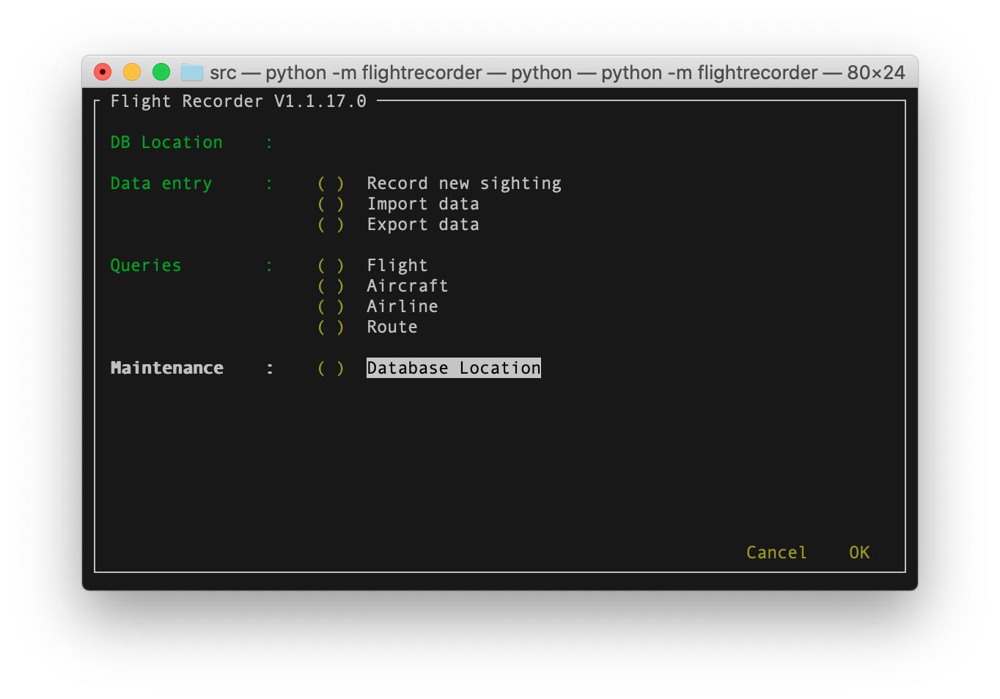

# FlightRecorder

[](https://github.com/davewalker5/FlightRecorder/issues)
[](https://github.com/davewalker5/FlightRecorder/releases)
[](https://github.com/davewalker5/FlightRecorder/blob/master/LICENSE)
[](https://github.com/davewalker5/FlightRecorder/)
[](https://github.com/davewalker5/FlightRecorder/)
[](https://github.com/davewalker5/FlightRecorder/)

## About FlightRecorder

FlightRecorder is a terminal-based application for recording aircraft sightings, written in Python 3 with SQLite for data storage.

## Features

The application has the following features:

- Recording of sightings, with pre-population of data where possible to reduce data entry
- Query the data by:
  - Flight number
  - Aircraft registration number
  - Airline
  - Route, defined by the point of embarkation and the destination

Each sighting consists of the following data:

- Flight details
  - Flight number
  - Embarkation airport
  - Destination
  - Airline
- Aircraft details
  - Registration details
  - Manufacturer
  - Model
- Sighting details
  - Date
  - Altitude when sighted
  - Location

## Getting Started

### Prerequisites

FlightRecorder is written using Python 3.7.4 so you will need a Python 3 installation to use the application.

### First Time Configuration

After cloning the repository, open a terminal window, change to the "src" folder of the working copy and run the following to complete first time configuration:

```shell
python -m venv --copies venv
source venv/bin/activate
pip install --upgrade pip
pip install npyscreen
pip install PyYAML
pip install SQLAlchemy
python resetconfig.py
deactivate
```

### Running the Application

To run the application, open a terminal window, change to the "src" folder of the working copy and run the following:

```shell
source venv/bin/activate
python -m flightrecorder
```

The application main screen will be displayed:



Details of how to use the application are provided on the Wiki.

## Authors

- **Dave Walker** - *Initial work* - [LinkedIn](https://www.linkedin.com/in/davewalker5/)

## Feedback

To file issues or suggestions, please use the [Issues](https://github.com/davewalker5/UdpClientServer/issues) page for this project on GitHub.

## License

This project is licensed under the MIT License - see the [LICENSE](LICENSE) file for details.
